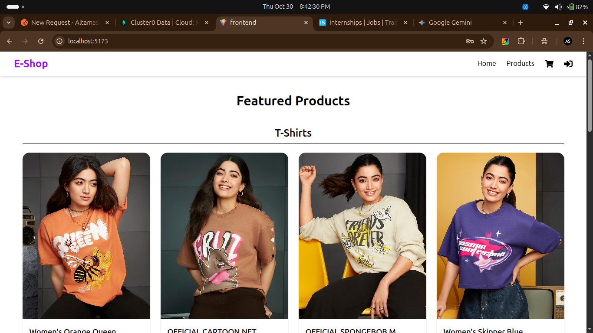
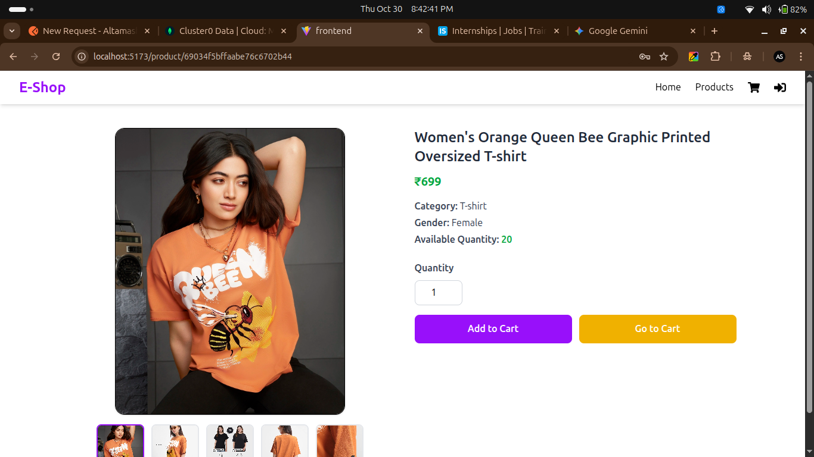
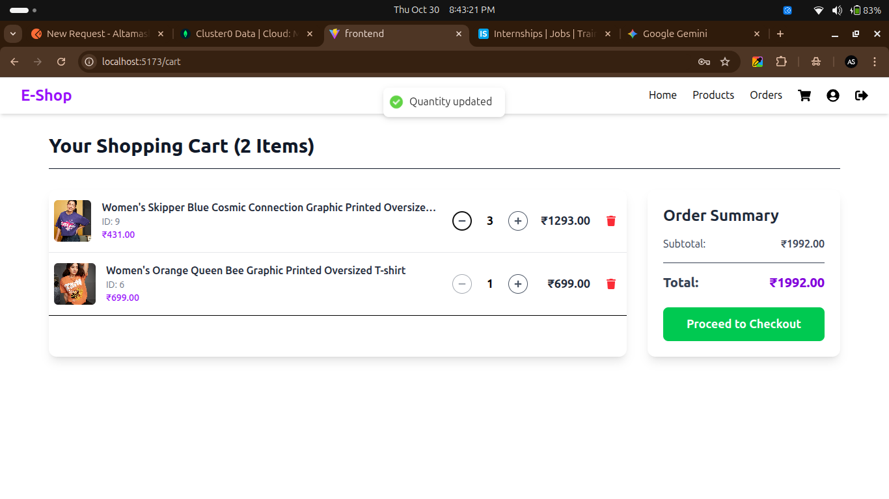
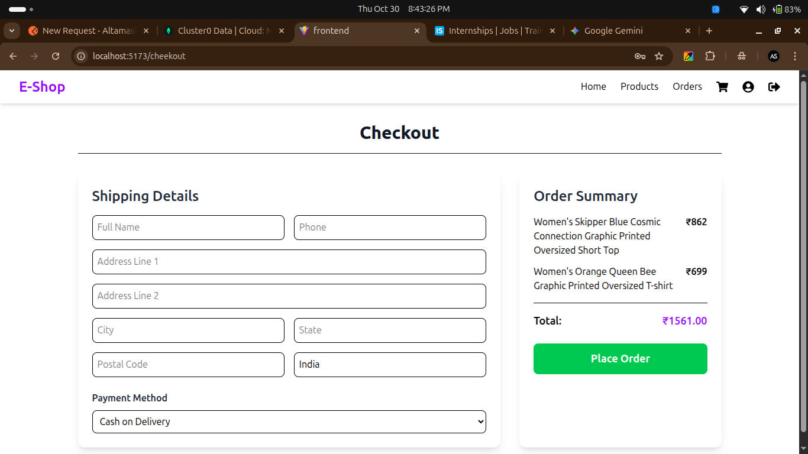

# 🛍️ E-Shop – Nexora Internship Assignment

A **Full-Stack E-Commerce Web Application** built as part of the **Nexora Internship Assignment**.  
The project includes both **frontend (React + Tailwind CSS)** and **backend (Node.js + Express + MongoDB)**.  

Users can register, log in, browse products, add them to the cart, and checkout — with full JWT authentication and MongoDB integration.

---

## 🚀 Tech Stack

### 🖥️ Frontend
- React.js (Vite)
- Tailwind CSS
- Axios
- React Router DOM
- React Hot Toast

### ⚙️ Backend
- Node.js
- Express.js
- MongoDB (Mongoose)
- JWT Authentication
- bcryptjs (Password Hashing)
- dotenv (Environment Variables)
- CORS Middleware

---

---

## ✨ Features

✅ User Registration & Login (JWT Auth)  
✅ Product Listing & Details  
✅ Add / Remove from Cart  
✅ Checkout Page with Order Summary  
✅ MongoDB for Data Storage  
✅ Responsive UI with Tailwind  
✅ Toast Notifications for Feedback  
✅ Protected Routes & Token Validation  

## ⚙️ Setup Instructions

Follow these steps to run the project locally 👇
### 1️⃣ Clone the Repository
```
git clone https://github.com/SkAltmash/E-Shop-Assignment-for-Nexora-.git
cd E-Shop-Assignment-for-Nexora-
```
### 2️⃣ Backend Setup

``` 
cd backend
npm install
```
####  Create a .env file inside the backend folder with:
```
MONGO_URI=your_mongodb_connection_string
JWT_SECRET=your_secret_key
PORT=8000
```
#### Start the backend server:

```
npm start
```


### Your backend will run at 👉 http://localhost:8000

### 3️⃣ Frontend Setup

```cd ../frontend
npm install
npm run dev
```

# API Endpoints
## Auth Routes
| Method | Endpoint             | Description         |
| ------ | -------------------- | ------------------- |
| POST   | `/api/auth/register` | Register new user   |
| POST   | `/api/auth/login`    | Login existing user |

## Product Routes
| Method | Endpoint            | Description        |
| ------ | ------------------- | ------------------ |
| GET    | `/api/products/all`     | Get all products   |
| GET    | `/api/products/:id` | Get single product |

## Cart Routes
| Method | Endpoint        | Description         |
| ------ | --------------- | ------------------- |
| POST   | `/api/cart/` | Add product to cart |
| GET    | `/api/cart`     | Get all cart items  |
| DELETE | `/api/cart/:id` | Remove from cart    |


## 🖼️ Screenshots


## Product Routes
|  home page        |  |
|  product page    | |
|  cart page    | |
|  checkout page    | |

|  order page    | |


# 🎥 Demo Video

## 🎬 Demo Link: Watch the Demo  https://youtu.be/7D4Gp2YT3nc


# 🧑‍💻 Developer

Name: Altamash Sheikh
GitHub: SkAltmash

Email: skaltmash3@gmail.com